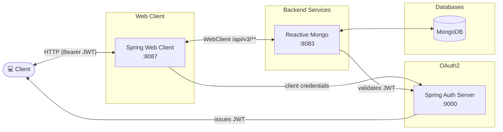

# spring-6-reactive-web-client

Welcome to the Reactive Programming with Spring Framework project! This project is a practical exploration of reactive programming using Spring Framework 5,
designed to help you understand and implement reactive systems. Here's a quick guide to get you started:

## Project Purpose

The main goal of this project is to demonstrate how to build reactive applications using Spring Framework. It depends on a backend service (project spring-6-reactive-mongo)
that interacts with MongoDB, showcasing how to handle asynchronous data streams effectively.

## Getting Started

* Backend Project spring-6-reactive-mongo Started listening on port 8083. The Backend is interacting with the MondoDB (either native running on mongodb://localhost:27017 or as Docker TestContainer
  which does not require installed MongoDB instance
* Docker Desktop: Required for running TestContainers, which are used for testing in a Docker environment.
- this application runs on port 8087/30087
- authentication server on port 9000/30900
- reactive-mongo module running on port 8083/30083
- gateway module running on port 8080 (no gateway in kubernetes)



## Web Interface

This application includes a web interface that allows users to interact with the beer data through a browser. The web interface provides the following features:

- View a paginated list of beers
- Navigate through pages of beer listings
- View details of individual beers

To access the web interface, start the application and navigate to:
- http://localhost:8087/beers
- http://localhost:30087/beers

To access the openapi ui from the reactive-mongo server:

- http://localhost:8083/swagger-ui/index.html
- http://localhost:30083/swagger-ui/index.html

## Sandbox (local dev environment)

The sandbox consists of the app (Spring Boot, port 8087) plus an auth-server (port 9000),
reactive-mongo (port 8083) and a gateway (port 8080), provided by `compose.yaml`. The services
start automatically via `spring.docker.compose.enabled=true` when the app boots, so usually one
step is enough.

### Start the sandbox (opencode-sandbox-kit)

The sandbox is provisioned by the opencode-sandbox-kit and runs as a Docker container. It mounts this
repo, starts opencode, and connects the IntelliJ MCP server.

Allow the kit source (GitHub without cloning):

```powershell
sbx settings set kit.allowedSources --% "[\"docker.io/\",\"github.com/dboeckli/\"]"
```

Start a new sandbox:

```powershell
sbx run opencode --name spring-6-reactive-web-client `
    --static-mcp idea `
    --kit "git+https://github.com/dboeckli/opencode-sandbox-kit.git#dir=opencode-agent" `
    -t docker/sandbox-templates:opencode-docker-0.5.0 `
    "C:\development\projects\spring-6-reactive-web-client" `
    "C:\development\maven-repo:ro"
```

Apply the kit to an existing sandbox (restarts the sandbox, VM state is kept):

```powershell
sbx kit add spring-6-reactive-web-client "git+https://github.com/dboeckli/opencode-sandbox-kit.git#dir=opencode-agent"
```

## Kubernetes

To run maven filtering for destination target/k8s and destination target/helm run:

```bash
mvn clean install -DskipTests 
```

### Deployment with Kubernetes

Deployment goes into the default namespace.

To deploy all resources:

```bash
kubectl apply -f target/k8s/
```

To remove all resources:

```bash
kubectl delete -f target/k8s/
```

Check

```bash
kubectl get deployments -o wide
kubectl get pods -o wide
```

You can use the actuator rest call to verify via port 30087

### Deployment with Helm

Be aware that we are using a different namespace here (not default).

Go to the directory where the tgz file has been created after 'mvn install'

```powershell
cd target/helm/repo
```

unpack

```powershell
$file = Get-ChildItem -Filter spring-6-reactive-web-client-chart-*.tgz | Select-Object -First 1
tar -xvf $file.Name
```

install

```powershell
$APPLICATION_NAME = Get-ChildItem -Directory | Where-Object { $_.LastWriteTime -ge $file.LastWriteTime } | Select-Object -ExpandProperty Name
helm upgrade --install $APPLICATION_NAME ./$APPLICATION_NAME --namespace spring-6-reactive-web-client --create-namespace --wait --timeout 5m --debug --render-subchart-notes
```

show logs and show event

```powershell
kubectl get pods -n spring-6-reactive-web-client
```

replace $POD with pods from the command above

```powershell
kubectl logs $POD -n spring-6-reactive-web-client --all-containers
```

Show Details and Event

$POD_NAME can be: spring-6-reactive-web-client-mongodb, spring-6-reactive-web-client

```powershell
kubectl describe pod $POD_NAME -n spring-6-reactive-web-client
```

Show Endpoints

```powershell
kubectl get endpoints -n spring-6-reactive-web-client
```

test

```powershell
helm test $APPLICATION_NAME --namespace spring-6-reactive-web-client --logs
```

status

```powershell
helm status $APPLICATION_NAME --namespace spring-6-reactive-web-client
```

uninstall

```powershell
helm uninstall $APPLICATION_NAME --namespace spring-6-reactive-web-client
```

delete all

```powershell
kubectl delete all --all -n spring-6-reactive-web-client
```

create busybox sidecar

```powershell
kubectl run busybox-test --rm -it --image=busybox:1.36 --namespace=spring-6-reactive-web-client --command -- sh
```

You can use the actuator rest call to verify via port 30087

